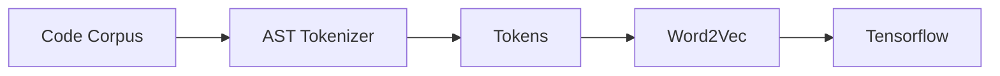

# DeepBugs Replication

## Description
For our ECE 595, Advanced Software Engineering, we are doing a replication of the [DeepBugs](https://arxiv.org/abs/1805.11683) study. The following sections describe our approach to conducting the replication.

## Process
Add info about specific dependencies and tools used (Python, Tensorflow, Github)
### Work Breakdown
*WBS here*

### Work Schedule
*Gantt chart here*

## Approach

### Code Corpus

### AST Tokens & Word2Vec
*UML of deepbugs-jr.py*

### Tensorflow
*Depiction of DL layers*

## Usage

## References
