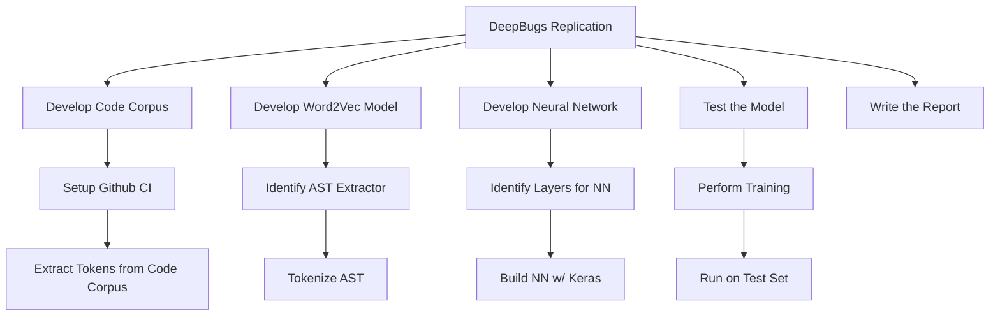
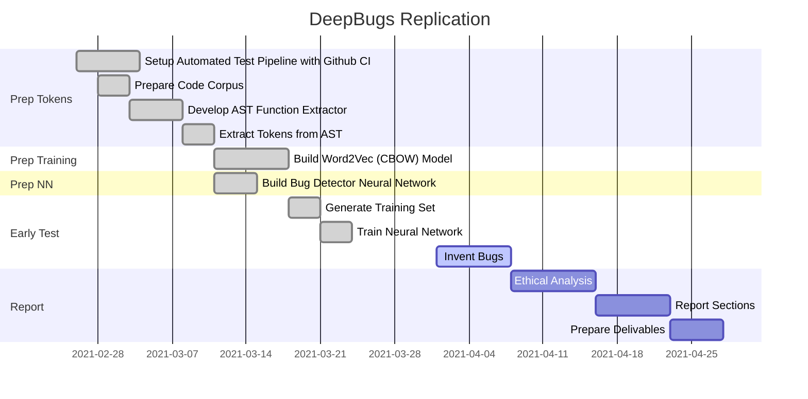

# DeepBugs Replication

## Description
For our ECE 595, Advanced Software Engineering, we are doing a replication of the [DeepBugs](https://arxiv.org/abs/1805.11683) study. The following sections describe our approach to conducting the replication.

## Process
To complete this task we set up a project on this Github project. Here we managed our version control, project planning, and continuous integration. Like the origin paper, our project was built using Python 3 to provide acess to the Tensorflow, Keras, and gensim modules, each integral to the completion of this project. Our team held weekly tag ups to provide status updates and delegate work as needed. Additional information regarding the task breakdown and workflow can be found in the following sections.

### Work Breakdown

### Work Schedule

### Code Corpus

### AST Tokens & Word2Vec
*UML of deepbugs-jr.py*

### Tensorflow
*Depiction of DL layers*

## Usage

## Dependencies
### Python Modules
+ ast2id_or_lit
+ word2vec
+ json
+ numpy
+ math
+ unittest
+ keras
+ Sequential
+ Dense
+ Dropout
+ KerasClassifier

## References
