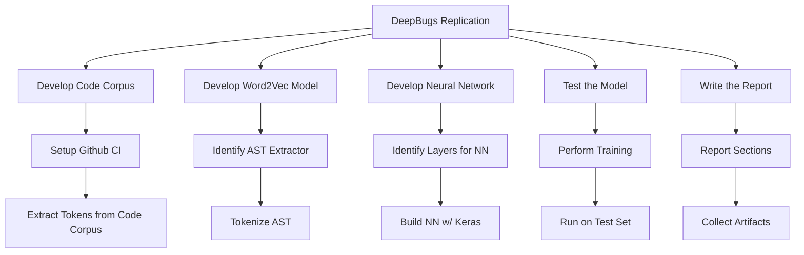
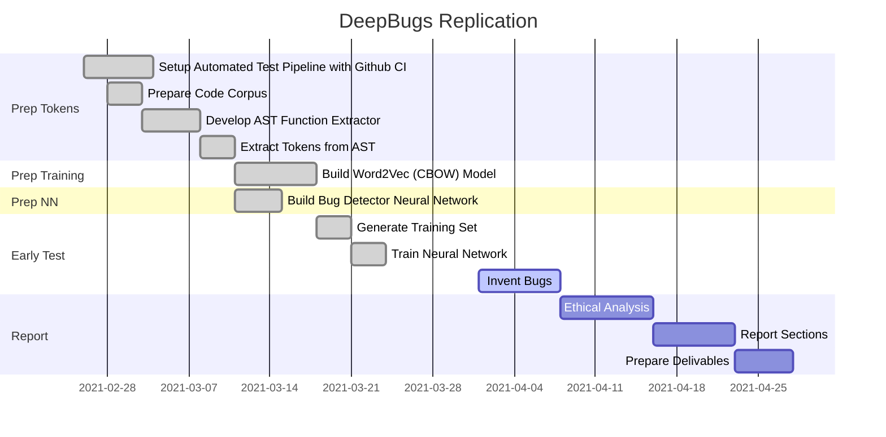
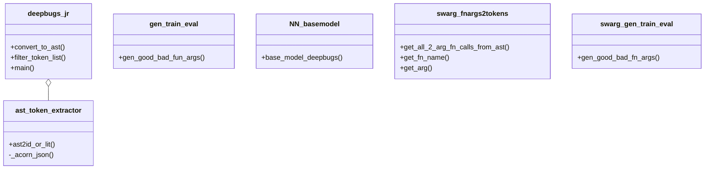
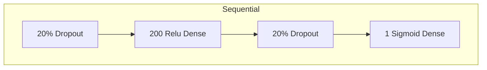

# DeepBugs Replication

## Summary

We conducted a replication of the [DeepBugs](https://arxiv.org/abs/1805.11683) study.
This replication was accepted in the artifact track of ESEC/FSE'21 as a way to grant the "Results Replicated" badge to the original work.

For the one-page abstract and a longer technical report, look in the directory `paper/`.

For the description of our replication process, read below.

## Description

The following sections describe our approach to conducting the replication.

To properly view some of the diagrams below, the [Mermaid-Diagrams](https://chrome.google.com/webstore/detail/mermaid-diagrams/phfcghedmopjadpojhmmaffjmfiakfil/related?hl=en-US) Chrome extenstion may be necessary.

## Process
To complete this task we set up a project on this Github project. Here we managed our version control, project planning, and continuous integration. Like the origin paper, our project was built using Python 3 to provide acess to the Tensorflow, Keras, and gensim modules, each integral to the completion of this project. Our team held weekly tag ups to provide status updates and delegate work as needed. Additional information regarding the task breakdown and workflow can be found in the following sections.

### Work Breakdown

### Work Schedule

### Code Corpus
The original Deepbugs study produced a [code corpus](https://www.sri.inf.ethz.ch/js150) which we made use of in our reproduction study. It contains over 100,000 javascript source files and their corresponding AST source files. These files allow us to have enough javascript to properly train our model.

### Development Scripts

### Tensorflow

#### Dropout layers
Dropout in neural network in general is a regularization method that approximates training a large number of neural networks with different architectures in parallel. By "dropping out" neurons, the over-fitting problem can be mitigated. The original authors of Deepbugs states in the paper that they applied a dropout of 0.2 to the input and the hidden layer. To replicate their work, we follow their approach of applying dropout layers. 

#### Dense layers
Dense layer is most commonly found layer in the models. It is a neural network layer that is connected deeply, which means each neuron in the dense layer receives input from all neurons of its previous layer. 

The original authors claims in their paper that they applied a feedforward neural network with an input layer of a size that depends on the code representation
provided by the specific bug detector, a single hidden layer of size 200, and an output layer with a single element that represents the probability computed by a bug detector.

## Usage
Read the guide in [demo_deepbugs_jr.ipynb](https://github.com/deep-bugs-jr/deep-bugs-jr/blob/main/demo_deepbugs_jr.ipynb).

## Dependencies
### Python Modules
+ tensorflow
+ keras
+ gensim
+ numpy

